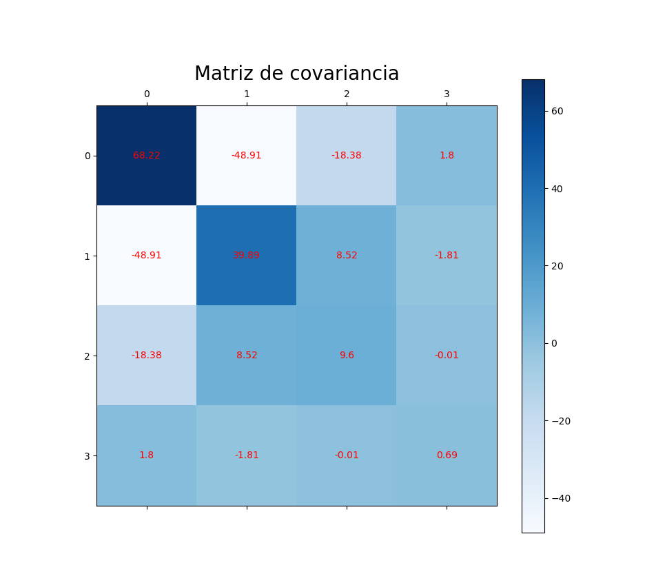
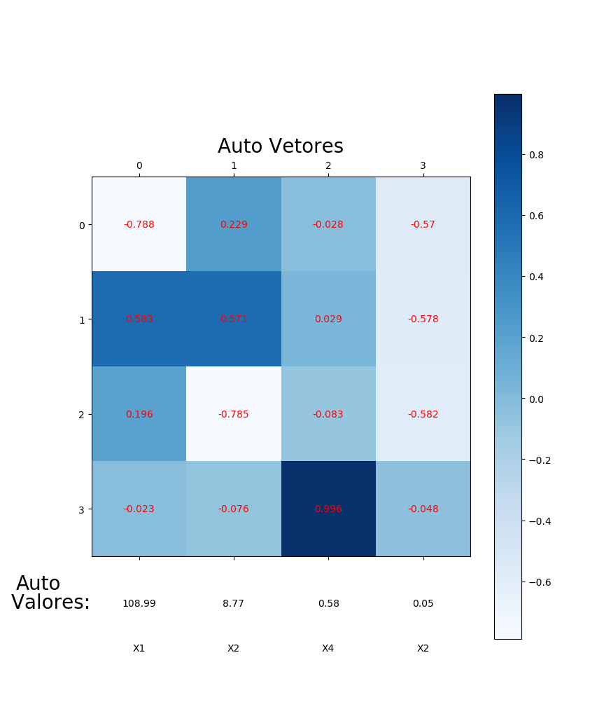
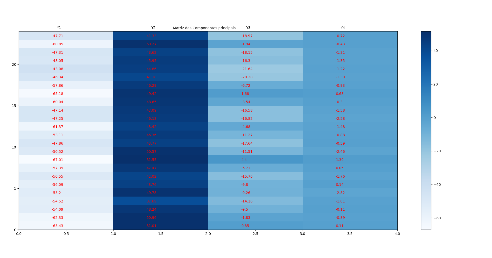
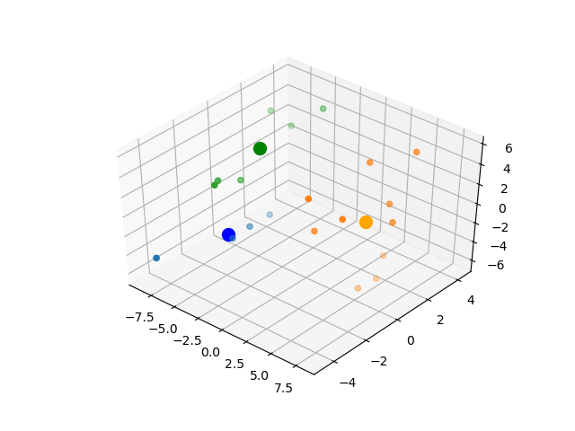
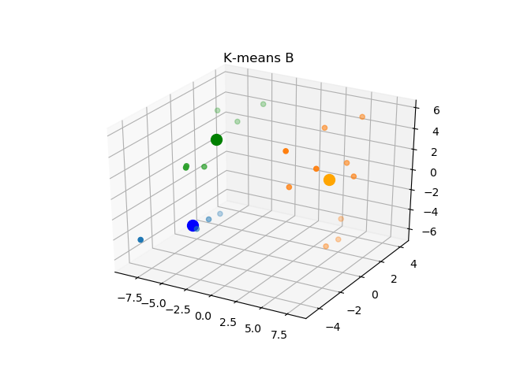
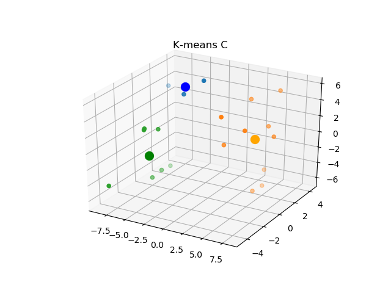
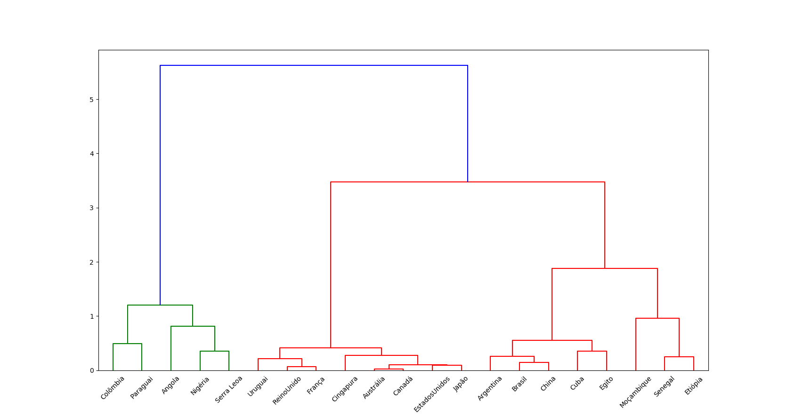
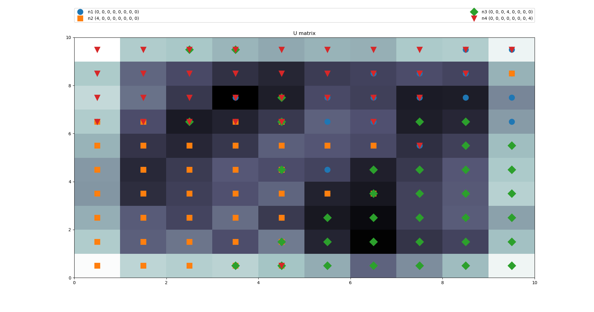
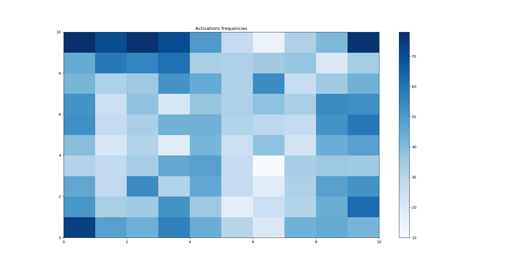
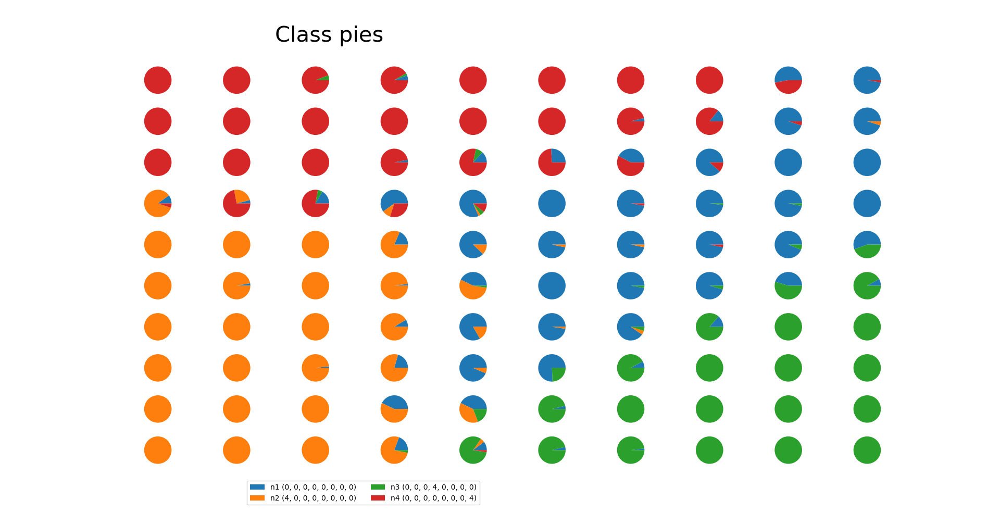

# lista-3-Aprendizagem-de-Maquinas-e-Mineracao-de-Dados

## Questão 1  
Considere o problema de análise de componentes principais (PCA), isto é, determinar
em uma distribuição de dados as componentes que tenham associadas a elas a maior
variância e representar as mesmas no espaço de dados formado pelos autovetores da matriz
de correlação. Neste sentido considere o seguinte problema.
A tabela abaixo apresenta os dados relativos a amostras de solo. Para cada amostra, tem-se
as medidas das porcentagens de areia (X1), sedimentos (X2), argila (X3) e a quantidade de
material orgânico (X4). Da referida tabela obtenha as estatísticas descritivas de cada
variável, isto é, a média, a mediana, o desvio padrão, os valores máximo e mínimo. Sob
estas condições :

a-) Obtenha desta tabela a matriz de covariância.

b-) Desta matriz determine os autovalores ordenados do máximo ao mínimo e os
autovetores correspondentes.

c-) Apresente as equações das componentes principais, isto é, cada componente é dada por

### estatísticas descritivas

#### X1  
max: 83.7  
min: 55.9  
média: 67.78  
desvio padrão: 8.09  
mediana: 67.45

#### X2  
max: 32.8  
min: 10.5  
média: 22.11  
desvio padrão: 6.18   
mediana: 22.9  

#### X3  
max: 17.6  
min: 5.8  
média: 10.2  
desvio padrão: 3.03  
mediana: 10.15

#### X4  
max: 4.4  
min: 0.9  
média: 2.83  
desvio padrão: 0.81  
mediana: 2.85

### 1-a)

    

### 1-b)
   

### 1-c)

### 1-d)  
considerando uma precisão de 3 casas decimais os percentuais ficaram:

(0.921, 0.074, 0, 0.005) então  

X1 > X2 > X4 > X5 

## Questão 2  

Considere o dados apresentados na [tabela](datasets/table.csv). Fazendo uso do algoritmo K-means ,
obtenha os centroides dos  
clusters. No processo de inicialização considere os itens (a) e (b) abaixo:

a) Considere que existam três clusters e a inicialização dos centros seja aleatória  

b) Considere que existam três clusters e a inicialização dos centros seja dada por:  
m_1 = (0,0,0)  
m_2 = (1,1,1)  
m_3 = (-1,0,2)  

c) Repita o item a considerando que os centros iniciais sejam:  
m_1 = (-0.1,0,0.1)  
m_2 = (0,-0.1,0.1)  
m_3 = (-0.1,-0.1,0.1)  
Compare obtido com o item (a) e explique a razão da diferenças, incluindo o número de interações para  
alcançar a convergência   

  

 

  

O algoritmo K-means é muito sensível em relação a posição inicial dos centroides por isso deve-se  
executar o algoritmo mais de uma fez e escolher a melhor configuração.  
No caso da letra A, por padrão a biblioteca sklearn executa o K-means 10 vezes e escolhe a melhor  
configuração. Também pro padrão o número maxímo de iterações é 300. algo que não foi alterado  
nos testes.  

## Questão 3  
Considere o processo de identificação de aglomerados (“clusters”) com base em uma técnica hierárquica  
aglomerativa. Neste problema considere o método de Ward resumido nas equações abaixo. Considere também  
dois critérios para parada do processo aglomerativo no dendograma e identificação do número de aglomerados.  
O critério R² e o critério o Pseudo T². Como dados para o problema considere a [tabela](datasets/onu2002.json) de índices de  
desenvolvimento de países  
(Fonte ONU- 2002, Livro – Análise de dados através de métodos de estatística multivariada – Sueli A. Mingoti)  

  

## Questão 4  

### Considerando 3 clusters

##### primeiro cluster  
Argentina, Cuba, Brasil, Egito, Moçambique, China  

##### segundo cluster  
Colombia , paraguai, Nigeria, Senegal, Sierra Leone, Angola, Etiópia

##### terceiro cluster
Reino Unido, Autralia, Canada, Estados Unidos, Japão, Fança ,Singapura , Uruguai

### Considerando 4 clusters

##### primeiro cluster  
Argentina, Cuba, Brasil, Egito, Moçambique, China  

##### segundo cluster  
Colombia, Nigeria, Sierra Leone, Angola

##### terceiro cluster
Reino Unido, Autralia, Canada, Estados Unidos, Japão, Fança ,Singapura , Uruguai

##### quarto cluster  
Paraguai, Senegal, Etiópia

## Questão 5
A propriedade de ordenação topológica do algoritmo SOM pode ser usada para formar
uma representação  
bidimensional abstrata de um espaço de entrada de alta dimensionalidade. Para investigar esta forma de  
representação, considere uma grade bidimensional consistindo de 10x10 neurônios que é treinada tendo como  
entrada os dados oriundos de quatro distribuições gaussianas, C 1 , C 2 , C 3 , e C 4 , em um espaço de entrada de  
dimensionalidade igual a oito, isto é x = (x_1,x_2,...,x_8). Todas as nuvens têm variâncias unitária, mas centros ou  
vetores média diferentes dados por:
m_1 = ( 0 , 0 , 0 , 0 , 0 , 0 , 0 , 0 )  
m 2 = ( 4 , 0 , 0 , 0 , 0 , 0 , 0 , 0 )  
m 3 = ( 0 , 0 , 0 , 4 , 0 , 0 , 0 , 0 )  
m 4 = ( 0 , 0 , 0 , 0 , 0 , 0 , 0 , 4 ) 
 
Calcule o mapa produzido pelo algoritmo SOM, com cada neurônio do mapa sendo rotulado com a classe particular  
mais representada pelos pontos de entrada em sua volta. O objetivo é visualizar os dados de dimensão 8 em um  
espaço de dimensão 2, constituído pela grade de neurônios  

  
  
  

